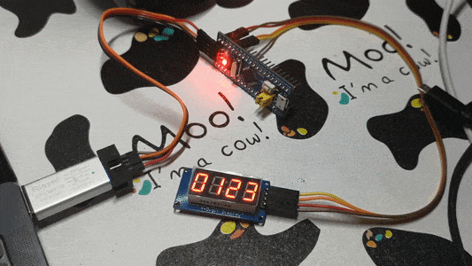

# tm1637-display-demo

Example on operations for TM1637 8-char display module, STM32F104C8T6 with embedded Rust used. 
I used software simulated I2C becaude TM1637 does not follow common I2C protocol as it does not
require an I2C address.

The final result should be like this: 



# Build & Run

Before all the steps, you need to clone this repository to somewhere in your local storage. 
We assume that all the terminals mentioned in follow text is opened in the local repository folder.

## Hardware requirements

You need some simple hardware requirements:

- a STM32F104C8T6 module ('MCU board')
- a TM1637 8-char display module
- ST-LINK v2 debugger

This won't cost much, and you may easily buy them at eBay, Taobao, Tmall, Alibaba, JD or Idlefish.

## Software requirements 

Some softwares are required to build this project. If you still do not know how to install after this 
section, don't worry and try searching online. There are many documents that could solve your problem.
All installations require an Internet connection.

### Install Rust

To build this project, you also need to have [Rust](https://rust-lang.org) compiler installed. 
Follow instructions on [install page](https://www.rust-lang.org/tools/install), or run `rustup update`
if already installed. You may check your Rust version using `rustc -V`.

### A special Rust target

Note that out Cortex-M3 chip requires a special Rust target being installed. 
Just follow this command line:

```
rustup target add thumbv7m-none-eabi
```

Usable Internet connection is required at this step. If you find the installation 
being slow, you might need to search Google for a rustup mirror.

### Install OpenOCD and GDB

By using `openocd -v`, you may check if you already have OpenOCD installed and configured
properly to `PATH`. As for GDB, you may need a special `arm-none-eabi-gdb` or `gdb-multiarch`
or simply `gdb` for embedded Cortex-M3 targets. You may consult Google for a tutorial to do so.

After a proper GDB installed, you may need to change the config cargo uses to debug this program.
Read the instruction after `uncomment ONE of these three option to ...` in `.cargo/config` file 
to configure cargo to work well with your GDB.

## Hardware connection

Connect ST-LINK debugger with STM32F103C8T6 board properly, and plug the debugger onto your 
computer. Connect TM1637 module to proper 3.3-V or 5-V power supply pins of the MCU board
(the '3.3' and 'G'), its DIO to PB9 and its CLK to PB8. 
You may change DIO and CLK connection along with Rust code in `src/main.rs` also being changed.

## Execute on board

After hardware connection, we'll launch OpenOCD, and GDB follows using cargo. 
We are half done, let's go!

### Run OpenOCD

OpenOCD helps you connect to MCU board. Open a terminal and execute `openocd`. 
You should see these lines in the output (the 'Target voltage' may vary):

```
Info : clock speed 1000 kHz
Info : STLINK V2J17S4 (API v2) VID:PID 0483:3748
Info : Target voltage: 3.206829 
Info : stm32f1x.cpu: hardware has 6 breakpoints, 4 watchpoints
Info : Listening on port 3333 for gdb connections
```

If not or if with some errors, check the connections between debugger and MCU board, and run again.

### Run using Cargo and GDB

After OpenOCD connection, leave this terminal alone as we need this connection in following steps. 
Open another one and run this program as simple as:

```
cargo run
```

You'll see in the output that cargo is compiling this project, GDB is launched by cargo shortly after, 
GDB connects to OpenOCD and pauses for further instructions. 

After this step, you'll see something like `halted: PC: 0x0800638a` in GDB terminal. Input GDB
command `continue` and press enter, the terminal blocks after a `Continuing.` line. And at 
this time, you should see the final result similiar to what the first section shows.

# More examples

If you have three TM1637 screens, you can try to display on *all* of them! Try the example at 
`examples/three_screens.rs`! Note: you may change the pin you connect with source code modified
as well.

# Future plans

- Reuse hardware timer for mutliple screens
- Use hardware I2C instead of software simulated I2C implemetation
- Present a HH:MM clock example with symbol `:` blinking
- Write an abstract portable TM1637 library that can be used on other MCU brands

# Contributing

All kinds of contributions are welcomed! You may fire an issue or open pull requests if there is a 
mistake in code. Feature requests are welcomed and if you have one, just create an issue.

# Author

Luo Jia <luojia65@hust.edu.cn>, Wuhan, China 

# Special thanks

Some pieces of core are based on [cortex-m-quickstart](https://github.com/rust-embedded/cortex-m-quickstart).
Thanks to Cortex-M Team at Group of Embedded Rust at The Rust Team for your wonderful framework!

Work here cannot be done without support from the community. 
Thanks to everyone at [rust.cc](http://rust.cc) community for offering help, devices and love!
And thanks to [/u/dakesew](http://reddit.com/u/dakesew), [/u/K900_](http://reddit.com/u/K900_)
and [/u/jechase](http://reddit.com/u/jechase) at subreddit [/r/rust](http://reddit.com/r/rust) 
for advice and supports!

Special thanks to my group member [WetABQ](http://github.com/WetABQ), [HDJ](http://github.com/ChinaHDJ)
and [PeratX](http://github.com/PeratX) for supportive ideas! Dalao TQL! Mobike, mobike!

Thanks to my girlfriend who has never appeared, emmm...
